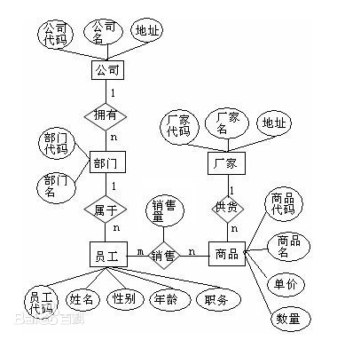

# 敏捷开发流程与项目管理:see_no_evil:
## 目录

[新项目启动](#4roy-1699847193411)

[一.需求宣讲 -1. 需求确认阶段 2Tech设计阶段](#tewf-1645624250410)

[1.需求澄清](#vj7p-1645624256738)

[2.需求评审](#jiz9-1645683962469)

[二.技术栈设计阶段](#x73r-1649150680482)

[1.（系统选型+系统架构）选择技术栈，搭建开发环境](#spvh-1645624175668)

[2.框架搭建](#dl1j-1670441523920)

[3.根据页面划分模块和功能点  ](#rpco-1645624175665)

[项目协同工具:(过程协同)](#7fl1-1653445821697)

[conf、](#adin-1699846118535)

[Arths](#6dxd-1699846160582)

[jira (项目计划、任务)   ](#pher-1699846119684)

[禅道（bug管理）](#zkzt-1699846121236)

[ yipi( 测试)  ](#supa-1699846122320)

[  三.开发分工3.开发分支建立 ](#gicp-1646027564182)

[-开发分支建立](#6wr7-1699846323525)

[-任务分工](#lkrh-1699846328890)

[-开发计划(甘特图)](#z5pw-1646029314993)

[四.开发阶段    4.开发过程代码review](#txme-1645624175671)

[-划分优先级，需要外部资源的，尽快提工单](#rilg-1699846217672)

[1.完善基本数据库设计，创建测试数据库](#kuhf-1645624175667)

[2.网络策略开通,涉及对接第三方接口测试环境和 生产环境 网络访问 问题](#pcnq-1699846402476)

[-代码评审(code review)](#eylw-1645624175671)

[1.每个工作日更新、提交（按功能点提交）](#nkf4-1645624175671)

[2.不要提交导致构建失败的代码（提交前pull，项目是否重启成功）](#g1pr-1645624175671)

[五.生产上线阶段   5.代码扫描和测试](#koq5-1645624175672)

[-网络部安全测试-渗透测试。](#xyby-1645624175672)

[-sonar扫描代码漏洞-漏洞扫描](#ip2b-1649150770558)

[六.release当前流程](#fnxs-1649150718140)

[七. releas版本的 hotfix](#uo75-1649150798329)

[项目验收交付，接管运维二开](#ajbg-1666840711611)

[1.本地开发运维环境搭建(二开)](#eqho-1666841230059)

[-基础环境-中间件数据库配置，](#lapx-1699846753538)

[-业务代码开发环境](#1swv-1699846755082)

[2.跟进验收交付](#pff6-1666841263111)

[-交付标准、](#ahno-1699846892665)

[-交付流程、](#ahge-1699846894923)

[-交付清单，](#vle5-1699846895752)

[-有调和问题抛出给商务](#yoqg-1699846897272)

[项目汇报模板](#yazn-1646015076644)

[IT问题整理分类](#ikjl-1669736274818)

[一.需要跨部门解决](#covt-1669736342972)

[-网络类问题，找基础架构支持](#xbvd-1669737111358)

[-配置问题，找人支持](#vekq-1669737124238)

**新项目启动**

anyway, 需求调研产品做，省略.....

PS:欧美国家在设计阶段初期，花费的时间比较多。应该考虑可靠性、可扩展性、可维护性。

像做leetcode题目一样，不能盲目做，要思考好整体思路方案，效率才高

**一.需求宣讲 -1. 需求确认阶段 2Tech设计阶段**

1\.如果是已经确定是大型系统，确定QPS，则需要分布式，先压测单个实例的瓶颈

2.读写瓶颈-数据库io，读瓶颈用redis，写瓶颈用消息队列。

**1.需求澄清**

了解需求背景，主要功能

会后具体分析需求---

**需求文档的全面的重要性：涉及设计、开发和维护**

原型上面的字段含义需要添加描述，有什么限制没有？可选填的内容，数据格式（数组类型以半角,分割）

以及存在对应关系的字段。（1：1 ，1：n，n：m  （所属关系，上下级关系）） 部门关系，部门类型的关系

根据页面原型(越完整，对系统设计越有利,**根据e-r图和数据库设计反推页面字段限制，实体关系**)、流程图和需求画出 E-R 图，初步设计数据库（重要，分析需求漏洞）

矩形框：表示实体

[菱形](https://baike.baidu.com/item/%E8%8F%B1%E5%BD%A2)框：表示联系

椭圆形框：表示实体或联系的属性，将属性名记入框中。对于[主属性](https://baike.baidu.com/item/%E4%B8%BB%E5%B1%9E%E6%80%A7)名，则在其名称下划一下划线。

**2.需求评审**

针对需求分析提出问题（逻辑漏洞），并得到解答

**二.技术栈设计阶段**

**1.（系统选型+系统架构）选择技术栈，搭建开发环境**

选开源生态好的技术框架，不要用偏门和新的（mybatis-plus国产开源，维护人很少，反馈问题较多）

多状态问题：使用100 ，200这种设计，留有中间数字排序可扩展   

公共方法，应该设计粒度最小化

涉及到逻辑处理的 后端做转换，只是单纯页面展示结果的，前端做转换

**2.框架搭建**

drs

已有框架基础上

添加了：

mybatis-Generator

添加了分页工具 PageUtil

改造了 全局异常处理

**3.根据页面划分模块和功能点**  

按模块来分工

对功能点进行人天评估，制定开发计划和开发分工

**项目协同工具:(过程协同)**

**conf、**

**Arths**

**jira (项目计划、任务)**   

**禅道（bug管理）**

 **yipi( 测试)**  

  **三.开发分工3.开发分支建立** 

**-开发分支建立**

**-任务分工**

<table><tr><th></th><th>模块</th><th>具体页面</th><th>功能点</th><th>工作量</th><th>阶段</th><th>前端开发</th><th>进度</th><th>后台开发</th><th>进度</th><th>联调进度</th><th>说明</th></tr>
<tr><td>1</td><td>数据库设计</td><td>DB</td><td>
资源表/优惠券表/规则表/订单表

</td><td>大</td><td></td><td></td><td></td><td>雄爷</td><td>100%</td><td></td><td></td></tr>
<tr><td rowspan="3">2</td><td rowspan="3">
<s>资源维护</s>

</td><td>贵宾休息室</td><td>资源创建与维护</td><td>小</td><td></td><td></td><td></td><td></td><td></td><td></td><td></td></tr>
<tr><td>预付费行李</td><td>资源创建与维护</td><td>小</td><td></td><td></td><td></td><td></td><td></td><td></td><td></td></tr>
<tr><td>机票销售</td><td><s>机票销售的维度为OD直接使用黑屏里面的内容，不单独新建资源维护在本地</s></td><td>中</td><td></td><td></td><td></td><td></td><td></td><td></td><td>对接黑屏资源</td></tr>
<tr><td rowspan="13">
3

</td><td rowspan="13">
优惠券管理

</td><td rowspan="2">
满减优惠券创建

</td><td>满减优惠券创建</td><td>小</td><td></td><td>岑绍祥</td><td>100%</td><td>何振西</td><td>100%</td><td></td><td></td></tr>
<tr><td>使用规则</td><td>中</td><td></td><td>岑绍祥</td><td>100%</td><td>何振西</td><td>100%</td><td></td><td></td></tr>
<tr><td rowspan="2">
满折优惠券创建

</td><td>满折优惠券创建</td><td>小</td><td></td><td>岑绍祥</td><td>100%</td><td>何振西</td><td>100%</td><td></td><td></td></tr>
<tr><td>使用规则</td><td>中</td><td></td><td>岑绍祥</td><td>100%</td><td>何振西</td><td>100%</td><td></td><td></td></tr>
<tr><td rowspan="2">
免费兑换券创建

</td><td>免费兑换券创建</td><td>小</td><td></td><td>岑绍祥</td><td>100%</td><td>何振西</td><td>100%</td><td></td><td></td></tr>
<tr><td>使用规则</td><td>中</td><td></td><td>岑绍祥</td><td>100%</td><td>何振西</td><td>100%</td><td></td><td></td></tr>
<tr><td rowspan="7">券管理</td><td>优惠券查询</td><td>小</td><td></td><td>岑绍祥</td><td>100%</td><td>何振西</td><td>100%</td><td></td><td></td></tr>
<tr><td>获取优惠券详情</td><td>小</td><td></td><td>岑绍祥</td><td>70</td><td>何振西</td><td>100%</td><td></td><td></td></tr>
<tr><td>优惠券编辑</td><td>小</td><td></td><td>岑绍祥</td><td>100%</td><td>何振西</td><td>100%</td><td></td><td></td></tr>
<tr><td>优惠券发布</td><td>小</td><td></td><td>岑绍祥</td><td>100%</td><td>何振西</td><td>100%</td><td></td><td></td></tr>
<tr><td>优惠券删除</td><td>小</td><td></td><td>岑绍祥</td><td>100%</td><td>何振西</td><td>100%</td><td></td><td></td></tr>
<tr><td>待领取优惠券</td><td>小</td><td></td><td></td><td></td><td>何振西</td><td>100%</td><td></td><td>小程序端待领取的优惠券列表</td></tr>
<tr><td>活动添加查询优惠券</td><td>中</td><td></td><td></td><td></td><td>何振西</td><td>100%</td><td></td><td></td></tr>
<tr><td rowspan="6"><b>5</b></td><td rowspan="6"><b>权益包管理</b></td><td rowspan="6">权益包管理</td><td>活动创建</td><td>中</td><td></td><td>荆建强</td><td>100%</td><td>麦树仁</td><td>100%</td><td></td><td></td></tr>
<tr><td>活动查询</td><td>小</td><td></td><td>荆建强</td><td>100%</td><td>麦树仁</td><td>100%</td><td></td><td></td></tr>
<tr><td>活动编辑</td><td>中</td><td></td><td>荆建强</td><td>100%</td><td>麦树仁</td><td>100%</td><td></td><td></td></tr>
<tr><td>活动发布</td><td>小</td><td></td><td>荆建强</td><td>100%</td><td>麦树仁</td><td>100%</td><td></td><td></td></tr>
<tr><td>活动删除</td><td>小</td><td></td><td>荆建强</td><td>100%</td><td>麦树仁</td><td>100%</td><td></td><td></td></tr>
<tr><td>活动禁用</td><td>小</td><td></td><td>荆建强</td><td>100%</td><td>麦树仁</td><td>100%</td><td></td><td></td></tr>
</table>

**做得优秀>能做出来 >>做不出来**

**先别急着做，重要！！！方法论-想想有哪些可以解决问题的方法先！！**

**-开发计划(甘特图)**

|序号|任务项|计划开始时间|计划完成时间|实际开始时间|实际完成时间|状态|进度|计划人天|实际人天|
| :- | :- | :- | :- | :- | :- | :- | :- | :- | :- |
|1|需求调研|||||已完成||||
|2|需求宣讲|2021/5/11|2021/5/11|2021/5/11|2021/5/11|已完成||||
|3|开发|2021/5/13|2021/6/01|2021/5/17|2021/6/01|已完成||||
|4|内测|2021/6/2|2021/6/11|2021/6/2||进行中||||
|5|上线准备|2021/6/15|2021/6/15|||未开始||||
|6|上线|2021/6/16|2021/6/16|||未开始||||

|||||||||||
| :- | :- | :- | :- | :- | :- | :- | :- | :- | :- |

**四.开发阶段    4.开发过程代码review**

**-划分优先级，需要外部资源的，尽快提工单**

**1.完善基本数据库设计，创建测试数据库**

**2.网络策略开通,涉及对接第三方接口测试环境和 生产环境 网络访问 问题**

接口文档- 需要双方合作的，定义接口规范或者指定好约定，按照约定，解耦开发

两种对接方式

api  返回json格式（纯数据）

sdk/jar包  提供开发环境，调用方法返回java bean

开发时检测----- 阿里巴巴代码规约、sonar扫描

**-代码评审(code review)**

**1.每个工作日更新、提交（按功能点提交）**

**2.不要提交导致构建失败的代码（提交前pull，项目是否重启成功）**

**五.生产上线阶段   5.代码扫描和测试**

**-网络部安全测试-渗透测试。**

**-sonar扫描代码漏洞-漏洞扫描**

**六.release当前流程**

**七. releas版本的 hotfix**

**项目验收交付，接管运维二开**

**1.本地开发运维环境搭建(二开)**

**-基础环境-中间件数据库配置，**

**-业务代码开发环境**

**2.跟进验收交付**

跟项目经理和供应商项目经理沟通，从开发角度跟进

**-交付标准、**

**-交付流程、**

**-交付清单，**

**-有调和问题抛出给商务**

**项目汇报模板**

1.序号跟进事项提出人责任人状态进度提出时间计划完成日期备注（问题详细补充、解决方案描述）

2.汇报项目跟进状态、整体把控、目前存在问题。重要会议汇报纪要

3.思考怎么把完美饱满的工作更好表达

**IT问题整理分类**

**一.需要跨部门解决**

**-网络类问题，找基础架构支持**

**-配置问题，找人支持**
